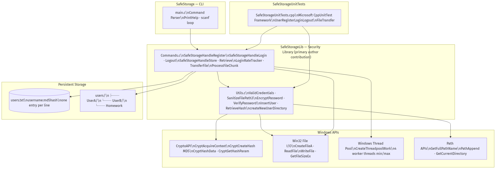
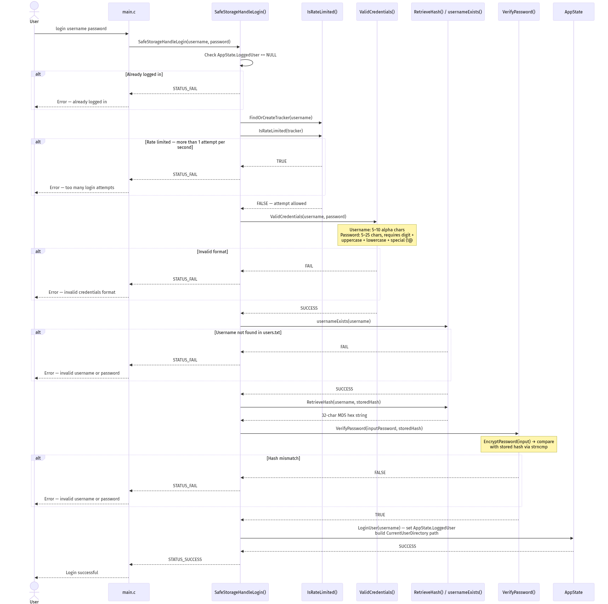
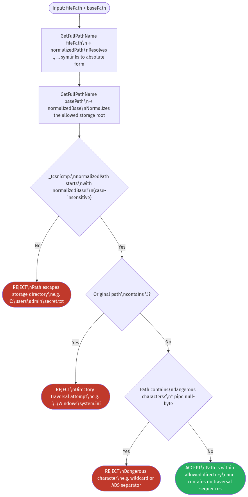
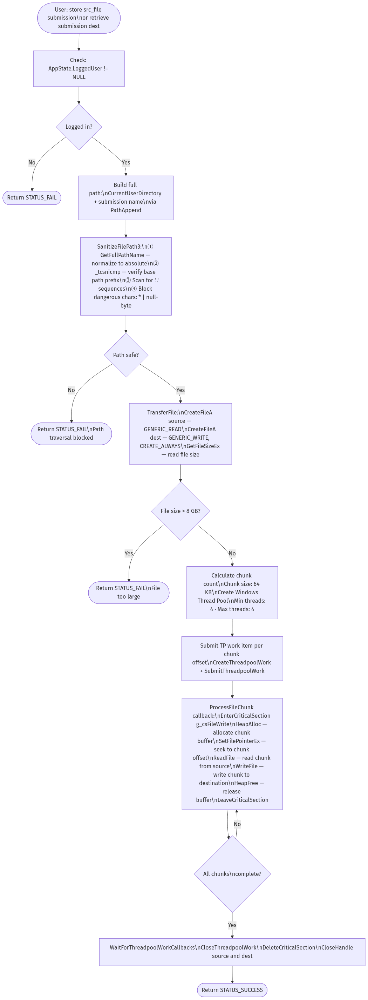

# SafeStorage

A **Windows CLI secure file storage system** built in C, developed as part of a Software Security / Secure Coding course. Users register, authenticate, and store or retrieve files in isolated personal directories on disk.

The security library (`SafeStorageLib`) is the primary engineering contribution — it implements all authentication, cryptographic hashing, input validation, path traversal prevention, and multi-threaded file transfer logic from scratch using Windows APIs.

---

## Security Features

Five distinct threat categories are defended against:

| Threat                          | Implementation                                                                                                                                                                  |
| ------------------------------- | ------------------------------------------------------------------------------------------------------------------------------------------------------------------------------- |
| **Path traversal**              | `SanitizeFilePath3()` — path normalization via `GetFullPathName`, case-insensitive base-prefix enforcement, `..` detection, dangerous character blocking (`*`, `\|`, null-byte) |
| **Brute force**                 | `LoginRateTracker` — per-user in-memory rate limiting: 1 login attempt per second per username across an array of 100 tracked users                                             |
| **Buffer overflow**             | Bounded safe string APIs throughout (`strncpy_s`, `strncat_s`, `StringCchCopy`); `MAX_PATH` bounds enforced on all path buffers                                                 |
| **Unauthorized access**         | State-based access control on every command — read/write operations require an authenticated session (`AppState.LoggedUser`)                                                    |
| **Insecure credential storage** | Passwords hashed with MD5 via Windows CryptoAPI; plaintext passwords never written to disk                                                                                      |

---

## Architecture

> Diagram source: [docs/mermaid_code.md — Diagram 1](docs/mermaid_code.md#1-system-architecture)

**Three-project Visual Studio 2022 solution (Debug | x86):**

- **`SafeStorage/`** — CLI entry point (`main.c`); command parsing loop
- **`SafeStorageLib/`** — Security library (`Commands.c`, `Utils.c`); all auth, crypto, validation, file transfer logic — _primary contribution_
- **`SafeStorageUnitTests/`** — Microsoft CppUnitTest test suite covering the full register → login → store → retrieve → logout lifecycle

---

## Authentication Flow

> Diagram source: [docs/mermaid_code.md — Diagram 2](docs/mermaid_code.md#2-user-authentication-flow)

Login enforces: session state check → rate limit check → credential format validation → username existence → MD5 hash verification — in that order. Rate limiting occurs before any database I/O, minimizing attack surface.

---

## Path Traversal Prevention

> Diagram source: [docs/mermaid_code.md — Diagram 5](docs/mermaid_code.md#5-path-traversal-prevention--sanitizefilepath3)

All user-supplied file paths pass through `SanitizeFilePath3()` before any file handle is opened. A four-step pipeline — normalize, base-prefix match, traversal scan, dangerous-char check — ensures submitted paths cannot escape the user's storage directory.

**Original path traversal demo (course assignment):**

---

## File Transfer Flow

> Diagram source: [docs/mermaid_code.md — Diagram 4](docs/mermaid_code.md#4-file-transfer--store-and-retrieve)

File operations use the **Windows Thread Pool API** with 4 worker threads. Each 64 KB chunk is processed by a `ProcessFileChunk` callback that acquires a `CRITICAL_SECTION` for file pointer operations, allocates a heap buffer, performs the read/write at the correct offset, and frees the buffer — all before releasing the lock. File size is capped at **8 GB** via `GetFileSizeEx`.

---

## Commands

| Command    | Syntax                                   | Auth Required |
| ---------- | ---------------------------------------- | :-----------: |
| `register` | `register <username> <password>`         |      No       |
| `login`    | `login <username> <password>`            |      No       |
| `logout`   | `logout`                                 |      Yes      |
| `store`    | `store <src_path> <submission_name>`     |      Yes      |
| `retrieve` | `retrieve <submission_name> <dest_path>` |      Yes      |
| `exit`     | `exit`                                   |       —       |

**Username:** 5–10 alphabetic characters only.  
**Password:** 5–25 characters; must include digit, uppercase, lowercase, and a special character from `!@#$%^&`.

---

## Tech Stack

| Layer        | Technology                                                           |
| ------------ | -------------------------------------------------------------------- |
| Language     | C (C99), C++ (unit tests)                                            |
| Platform     | Windows x86                                                          |
| Cryptography | Windows CryptoAPI (`Bcrypt.lib`, `CALG_MD5`)                         |
| File I/O     | Win32 (`CreateFileA`, `ReadFile`, `WriteFile`, `GetFileSizeEx`)      |
| Concurrency  | Windows Thread Pool API (`CreateThreadpoolWork`, `CRITICAL_SECTION`) |
| Path APIs    | `GetFullPathName`, `PathAppend` (Shlwapi)                            |
| Testing      | Microsoft CppUnitTest Framework                                      |
| Build        | Visual Studio 2022, MSBuild                                          |

---

## Documentation

Full technical documentation including all security flow diagrams and data format specifications:  
**[docs/documentation.md](docs/documentation.md)**

Mermaid diagram source code for all 6 diagrams (render locally with [Mermaid Live](https://mermaid.live)):  
**[docs/mermaid_code.md](docs/mermaid_code.md)**
