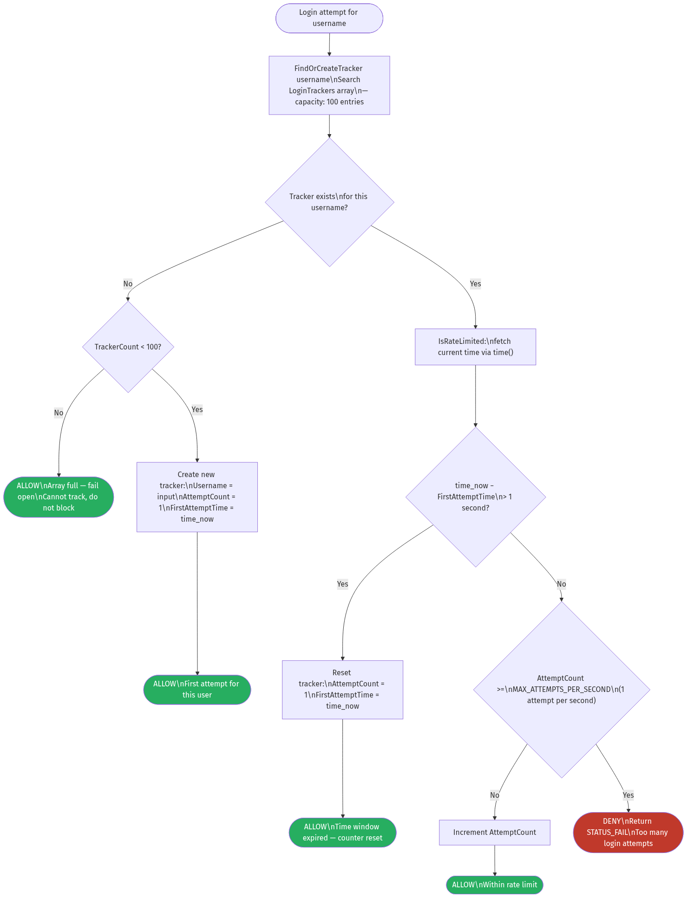
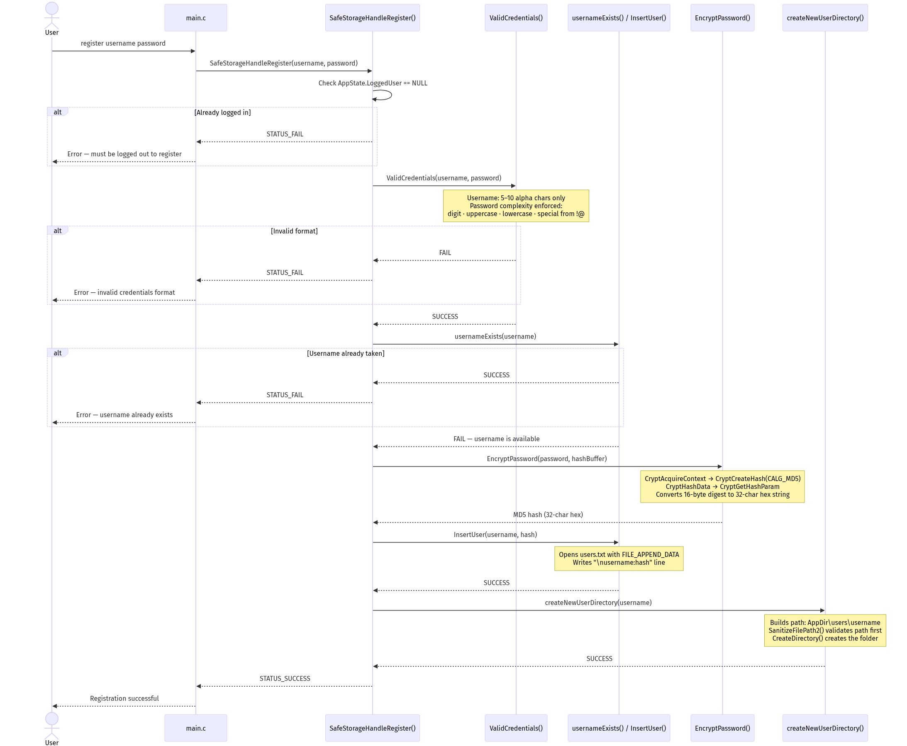

# SafeStorage — Technical Documentation

> This document provides in-depth technical coverage of SafeStorage, a secure file storage system built in C with a strong emphasis on defensive programming. For a high-level overview, see the [project README](../README.md).

---

## Table of Contents

1. [Project Overview](#1-project-overview)
2. [Architecture](#2-architecture)
3. [Security Features](#3-security-features)
   - [3.1 Input Validation](#31-input-validation)
   - [3.2 Password Hashing (MD5 via CryptoAPI)](#32-password-hashing-md5-via-cryptoapi)
   - [3.3 Path Traversal Prevention](#33-path-traversal-prevention)
   - [3.4 Brute Force / Rate Limiting](#34-brute-force--rate-limiting)
   - [3.5 Thread-Safe File Transfer](#35-thread-safe-file-transfer)
   - [3.6 File Size Enforcement](#36-file-size-enforcement)
4. [Authentication & Registration Flows](#4-authentication--registration-flows)
5. [File Transfer Flow](#5-file-transfer-flow)
6. [Command Reference](#6-command-reference)
7. [Project Structure](#7-project-structure)
8. [Data Formats](#8-data-formats)
9. [Testing](#9-testing)
10. [Known Limitations & Future Improvements](#10-known-limitations--future-improvements)

---

## 1. Project Overview

SafeStorage is a Windows **command-line secure file storage system** developed as part of a Software Security / Secure Coding course. The application allows users to register, authenticate, and store or retrieve files in isolated personal directories.

**Primary goal:** Demonstrate correct implementation of common security controls in low-level C.

**Scope of authorship:** The security library (`SafeStorageLib`) — covering authentication, cryptographic hashing, input validation, path sanitization, and multi-threaded file transfer — was the primary development contribution. This encompasses `Commands.c`, `Commands.h`, `Utils.c`, and `Utils.h`.

**Security threats defended against:**

| Threat                      | Defense Mechanism                                                                              |
| --------------------------- | ---------------------------------------------------------------------------------------------- |
| Buffer overflow             | Bounded safe string APIs (`strncpy_s`, `strncat_s`, `StringCchCopy`), `MAX_PATH` bounds        |
| Path traversal              | `SanitizeFilePath3()` — path normalization + base prefix enforcement + dangerous-char blocking |
| Brute force                 | `LoginRateTracker` — per-user rate limiting (1 attempt/second) with in-memory tracking         |
| Unauthorized access         | State-based access control — commands gated on `AppState.LoggedUser`                           |
| Insecure credential storage | MD5 hashing via Windows CryptoAPI (plaintext passwords never written to disk)                  |

---

## 2. Architecture


> **Render:** See [mermaid_code.md — Diagram 1](mermaid_code.md#1-system-architecture) for the source. Rendered PNG saved as `docs/architecture.png`.

The solution is composed of three Visual Studio projects targeting **Windows x86**:

### SafeStorage (CLI)

`SafeStorage/main.c` — The command-line entry point. Initializes the library via `SafeStorageInit()`, prints help, then enters a `scanf` loop parsing user commands. Delegates all logic to `SafeStorageLib`.

### SafeStorageLib (Security Library)

The core security implementation, split across two modules:

**`Commands.c` / `Commands.h`**

- Manages application session state (`APP_STATE` struct: `LoggedUser`, `CurrentUserDirectory`)
- Implements all user-facing command handlers
- Owns the `LoginRateTracker` system (100-entry in-memory array)
- Orchestrates the multi-threaded `TransferFile()` with `ProcessFileChunk()` callbacks
- Enforces access control at every command entry point

**`Utils.c` / `Utils.h`**

- Username and password validation (`ValidCredentials`, `SanitizedUsername`, `SanitizedPassword`)
- Password hashing (`EncryptPassword`) and verification (`VerifyPassword`) via Windows CryptoAPI
- Path traversal sanitization (`SanitizeFilePath`, `SanitizeFilePath2`, `SanitizeFilePath3`)
- File-based user database management (`InsertUser`, `RetrieveHash`, `usernameExists`)
- Directory lifecycle (`createUsersDirectory`, `createNewUserDirectory`, `buildUserPathAndCheckIfExists`)

### SafeStorageUnitTests

`SafeStorageUnitTests.cpp` — Microsoft CppUnitTest-based tests covering the full registration→login→store→retrieve→logout lifecycle. Uses C++17 `<filesystem>` for file existence assertions.

---

## 3. Security Features

### 3.1 Input Validation

All user-supplied credentials are validated before any storage or authentication operation occurs.

**Username validation (`SanitizedUsername`):**

| Rule               | Value                                                               |
| ------------------ | ------------------------------------------------------------------- |
| Minimum length     | 5 characters                                                        |
| Maximum length     | 10 characters                                                       |
| Allowed characters | English alphabetic only (`isalpha`) — no digits, spaces, or symbols |

**Password validation (`SanitizedPassword`):**

| Rule                | Value                       |
| ------------------- | --------------------------- |
| Minimum length      | 5 characters                |
| Maximum length      | 25 characters               |
| Required: digit     | At least one `0–9`          |
| Required: uppercase | At least one `A–Z`          |
| Required: lowercase | At least one `a–z`          |
| Required: special   | At least one from `!@#$%^&` |

`ValidCredentials()` combines both checks and emits descriptive error messages, returning `FAIL` if either fails.

---

### 3.2 Password Hashing (MD5 via CryptoAPI)

Passwords are **never stored in plaintext**. On registration, `EncryptPassword()` uses the Windows CryptoAPI to produce an MD5 digest:

```
CryptAcquireContext (PROV_RSA_FULL)
  └─ CryptCreateHash (CALG_MD5)
       └─ CryptHashData (password bytes)
            └─ CryptGetHashParam (HP_HASHVAL)
                 └─ Binary → 32-char lowercase hex string
```

The 32-character hex string (e.g., `ed857a8a0ca3a36052dbbd625c6a4398`) is appended to `users.txt` as `username:hash`.

On login, `VerifyPassword()` re-hashes the supplied password and compares it with the stored value using `strncmp` after first validating that the stored hash is exactly 32 characters.

> **Security note:** MD5 is cryptographically broken. See [Known Limitations](#10-known-limitations--future-improvements) for the upgrade path.

---

### 3.3 Path Traversal Prevention


> **Render:** See [mermaid_code.md — Diagram 5](mermaid_code.md#5-path-traversal-prevention--sanitizefilepath3) for the source.

File store and retrieve operations run every user-supplied path through `SanitizeFilePath3()`, the strictest of three sanitization variants. The function enforces four sequential checks:

1. **Normalize:** `GetFullPathName` resolves the input to an absolute path, collapsing any `.`, `..`, and relative segments.
2. **Base prefix check:** `_tcsnicmp` (case-insensitive) verifies the normalized path begins with the user's storage directory root. Any path that resolves outside the user's directory is rejected.
3. **Traversal sequence check:** The original path is scanned for `..` sequences.
4. **Dangerous character check:** Any occurrence of `*`, `|`, or null-byte is rejected to block wildcard abuse and alternative data stream (ADS) access.

**Examples of blocked inputs:**

| Input                      | Blocked at | Reason                               |
| -------------------------- | ---------- | ------------------------------------ |
| `../../Windows/system.ini` | Step 1 + 2 | Resolves outside storage root        |
| `..\..\..\etc\passwd`      | Step 2 + 3 | Base prefix mismatch; `..` present   |
| `submission\|malicious`    | Step 4     | Pipe character blocks ADS access     |
| `C:\Users\admin\secret`    | Step 2     | Hardcoded absolute path outside root |

---

### 3.4 Brute Force / Rate Limiting



> **Render:** See [mermaid_code.md — Diagram 6](mermaid_code.md#6-rate-limiting--login-brute-force-protection) for the source.

`SafeStorageHandleLogin()` enforces a per-username rate limit using an in-memory `LoginRateTracker` array before credential verification occurs.

**Data structure:**

```c
typedef struct {
    char Username[256];     // Tracked username
    uint32_t AttemptCount;  // Attempts within current window
    time_t FirstAttemptTime; // Start of current 1-second window
} LoginRateTracker;

// Constants
#define MAX_ATTEMPTS_PER_SECOND  1    // Max 1 login attempt per second per user
#define TRACKER_CAPACITY         100  // Maximum number of tracked users
```

**Logic (`IsRateLimited`):**

1. `FindOrCreateTracker` locates the entry for the username, creating one if it doesn't exist (up to 100 entries).
2. If `time_now − FirstAttemptTime > 1 second`, the window resets: `AttemptCount = 1`, `FirstAttemptTime = now` → **allow**.
3. If within the window and `AttemptCount >= MAX_ATTEMPTS_PER_SECOND` → **deny**, return `STATUS_FAIL`.
4. Otherwise increment count → **allow**.

Rate limiting occurs before any database I/O or hash computation, minimizing attack surface.

---

### 3.5 Thread-Safe File Transfer

File copy operations use the **Windows Thread Pool API** for parallel chunk processing.

**Key parameters:**

| Parameter        | Value                                                     |
| ---------------- | --------------------------------------------------------- |
| Chunk size       | 64 KB per work item                                       |
| Thread pool size | 4 I/O threads (min and max)                               |
| Synchronization  | `CRITICAL_SECTION g_csFileWrite` per-chunk                |
| Buffer lifetime  | `HeapAlloc` on entry, `HeapFree` on exit of each callback |

`TransferFile()` creates a `FILE_TRANSFER_INFO` struct per chunk containing the source/destination `HANDLE`, byte `Offset`, and `ChunkSize`. It then submits work items via `CreateThreadpoolWork` + `SubmitThreadpoolWork`. Each `ProcessFileChunk` callback:

1. Enters the critical section (serializes file pointer operations)
2. Allocates a heap buffer for the chunk
3. Seeks to the chunk offset via `SetFilePointerEx`
4. Reads from source via `ReadFile`
5. Seeks and writes via `WriteFile`
6. Frees the buffer
7. Leaves the critical section

`WaitForThreadpoolWorkCallbacks` drains all callbacks before handles are closed.

---

### 3.6 File Size Enforcement

`TransferFile()` calls `GetFileSizeEx()` immediately after opening the source file. If the size exceeds **8 GB** (enforced via `LARGE_INTEGER` comparison), the operation is aborted and both handles are closed cleanly before returning `FAIL`. This prevents resource exhaustion attacks via large file uploads.

---

## 4. Authentication & Registration Flows


> **Render:** See [mermaid_code.md — Diagram 2](mermaid_code.md#2-user-authentication-flow) for the source.



> **Render:** See [mermaid_code.md — Diagram 3](mermaid_code.md#3-user-registration-flow) for the source.

Both flows enforce:

- **State gate:** Commands check `AppState.LoggedUser` before any logic. Login/register require the user to be logged out; store/retrieve/logout require the user to be logged in.
- **Validation before I/O:** Neither the database file nor the file system is touched until all format validations pass.
- **Consistent error messages:** Login returns the same error string whether the username doesn't exist or the password is wrong, preventing username enumeration.

---

## 5. File Transfer Flow


> **Render:** See [mermaid_code.md — Diagram 4](mermaid_code.md#4-file-transfer--store-and-retrieve) for the source.

Both `store` and `retrieve` follow the same internal flow through `TransferFile()`. The only difference is path direction:

- **store:** source = user-supplied path; destination = `CurrentUserDirectory\submission`
- **retrieve:** source = `CurrentUserDirectory\submission`; destination = user-supplied path

In both cases, the user-controlled path component is sanitized by `SanitizeFilePath3()` before any file handle is opened.

---

## 6. Command Reference

| Command    | Syntax                                        | Requirements                     | Description                                               |
| ---------- | --------------------------------------------- | -------------------------------- | --------------------------------------------------------- |
| `register` | `register <username> <password>`              | Must be logged out               | Creates a new user account and personal storage directory |
| `login`    | `login <username> <password>`                 | Must be logged out; rate-limited | Authenticates the user and starts a session               |
| `logout`   | `logout`                                      | Must be logged in                | Ends the current session, frees session memory            |
| `store`    | `store <src_file_path> <submission_name>`     | Must be logged in                | Copies a file into the user's storage directory           |
| `retrieve` | `retrieve <submission_name> <dest_file_path>` | Must be logged in                | Copies a file from the user's storage to a destination    |
| `exit`     | `exit`                                        | —                                | Calls `SafeStorageDeinit()` and terminates                |

**Username rules:** 5–10 alphabetic characters (`a–z`, `A–Z`), no digits or symbols.

**Password rules:** 5–25 characters; must include at least one digit, one uppercase letter, one lowercase letter, and one special character from `!@#$%^&`.

---

## 7. Project Structure

```
SafeStorage/
├── SafeStorage.sln                    Visual Studio 2022 solution (Debug|x86)
│
├── SafeStorage/                       CLI application
│   ├── main.c                         Entry point — command parsing loop
│   ├── users.txt                      Flat-file user database (username:md5hash)
│   ├── dummyData                      Sample file used in tests
│   └── SafeStorage.vcxproj
│
├── SafeStorageLib/                    Security library (primary contribution)
│   ├── Commands.c                     Command handlers, rate limiter, file transfer
│   ├── Commands.h                     API declarations, LoginRateTracker struct
│   ├── Utils.c                        Validation, crypto, path sanitization, DB I/O
│   ├── Utils.h                        Utility declarations, MD5/hash constants
│   ├── includes.h                     Centralized includes (Windows, CryptoAPI, etc.)
│   ├── Store.h                        Reserved header
│   └── SafeStorageLib.vcxproj
│
├── SafeStorageUnitTests/              Unit test project
│   ├── SafeStorageUnitTests.cpp       CppUnitTest test cases
│   ├── test_includes.hpp              C/C++ bridge header
│   └── SafeStorageUnitTests.vcxproj
│
└── docs/                              Documentation
    ├── documentation.md               This file
    ├── mermaid_code.md                Mermaid diagram source code
    ├── architecture.png               (render from mermaid_code.md diagram 1)
    ├── authentication_flow.png        (render from mermaid_code.md diagram 2)
    ├── registration_flow.png          (render from mermaid_code.md diagram 3)
    ├── file_transfer.png              (render from mermaid_code.md diagram 4)
    ├── path_traversal_prevention.png  (render from mermaid_code.md diagram 5)
    └── rate_limiting.png              (render from mermaid_code.md diagram 6)
```

---

## 8. Data Formats

### users.txt

The user database is a plain-text file, one record per line:

```
username:32_char_md5_hex_hash
```

Example:

```
UserA:ed857a8a0ca3a36052dbbd625c6a4398
UserB:7d151bc844f266a1e6c70fee1a52e360
```

Written by `InsertUser()` using `FILE_APPEND_DATA` + `WriteFile`. Read by `usernameExists()` and `RetrieveHash()` in 256-byte chunks with a partial-line carry buffer to handle chunk boundaries correctly.

### User directories

On successful registration, `createNewUserDirectory()` creates:

```
<AppDir>\users\<Username>\
```

Stored files are placed directly inside this directory using the caller-supplied submission name as the filename, after path validation.

### Session state

```c
typedef struct APP_STATE_STRUCT {
    char*  LoggedUser;            // Heap-allocated copy of username, or NULL
    TCHAR* CurrentUserDirectory;  // Heap-allocated full path to user's dir, or NULL
} APP_STATE;
```

Both fields are allocated on login and freed on logout via `SafeStorageHandleLogout()`.

---

## 9. Testing

Tests use the **Microsoft CppUnitTest** framework, bridged to the C library via `extern "C"` declarations in `test_includes.hpp`.

### Test Setup / Teardown

```
TEST_MODULE_INITIALIZE:
  - Remove pre-existing users.txt and users/ directory
  - Call SafeStorageInit() to establish clean state

TEST_MODULE_CLEANUP:
  - Call SafeStorageDeinit()
```

### Test Case 1: `UserRegisterLoginLogout`

1. `SafeStorageHandleRegister("UserA", "PassWord1@")` → expects `STATUS_SUCCESS`
2. Asserts `users.txt` exists as a regular file
3. Asserts `users/` directory exists
4. Asserts `users/UserA/` directory exists
5. `SafeStorageHandleLogin("UserA", "PassWord1@")` → expects `STATUS_SUCCESS`
6. `SafeStorageHandleLogout()` → expects `STATUS_SUCCESS`

### Test Case 2: `FileTransfer`

1. Registers user `UserB` with `PassWord1@`
2. Creates `dummyData` with content `"This is a dummy content"`
3. Logs in as `UserB`
4. `SafeStorageHandleStore(".\\dummyData", "Homework")` → expects `STATUS_SUCCESS`
5. Asserts `users/UserB/Homework` exists and its size matches the original
6. `SafeStorageHandleRetrieve("Homework", ".\\dummyData")` → expects `STATUS_SUCCESS`
7. Logs out

---

## 10. Known Limitations & Future Improvements

These limitations are documented in the spirit of security transparency. Identifying weaknesses is as important as implementing defenses.

### Cryptographic Issues

| Issue            | Current                     | Recommended Improvement                                     |
| ---------------- | --------------------------- | ----------------------------------------------------------- |
| Hash algorithm   | MD5 (broken)                | bcrypt, Argon2id, or scrypt                                 |
| Password salting | None                        | Per-user random salt, stored alongside hash                 |
| Hash iteration   | Single-pass                 | Tunable cost factor (KDF)                                   |
| Timing attack    | `strncmp` not constant-time | `CryptographicEquals` or memcmp-based constant-time compare |

### Input Handling

| Issue             | Location | Detail                                                                                                  |
| ----------------- | -------- | ------------------------------------------------------------------------------------------------------- |
| Unbounded `scanf` | `main.c` | `scanf("%s", buffer)` with no width specifier; vulnerable to stack buffer overflow on command arguments |
| Recommended fix   | `main.c` | Use `scanf_s` with explicit buffer sizes, or `fgets` + `sscanf`                                         |

### Authentication & Session

| Issue                          | Detail                                                                                                                                                                                                                   |
| ------------------------------ | ------------------------------------------------------------------------------------------------------------------------------------------------------------------------------------------------------------------------ |
| Rate limiter is in-memory only | Resets on application restart; persistent tracking (file or registry) would be more robust                                                                                                                               |
| Duplicate registrations        | `InsertUser` appends without locking the file; concurrent or sequential re-registration can create duplicate lines; first-match wins during lookup                                                                       |
| Single-user sessions           | `APP_STATE` is a single global; no concurrent multi-user support                                                                                                                                                         |
| Username existence leak        | `usernameExists` is checked before hash comparison; if error messages differ between "no such user" and "wrong password", username enumeration is possible (mitigated by consistent messaging in current implementation) |

### Infrastructure

| Issue                 | Detail                                                                                           |
| --------------------- | ------------------------------------------------------------------------------------------------ |
| users.txt permissions | No ACL enforcement; any process running as the same user can read or modify the hash database    |
| No audit log          | Failed logins and path traversal attempts are not persisted                                      |
| Windows-only          | Windows API dependencies (CryptoAPI, Win32 File I/O, Thread Pool) make the codebase non-portable |
