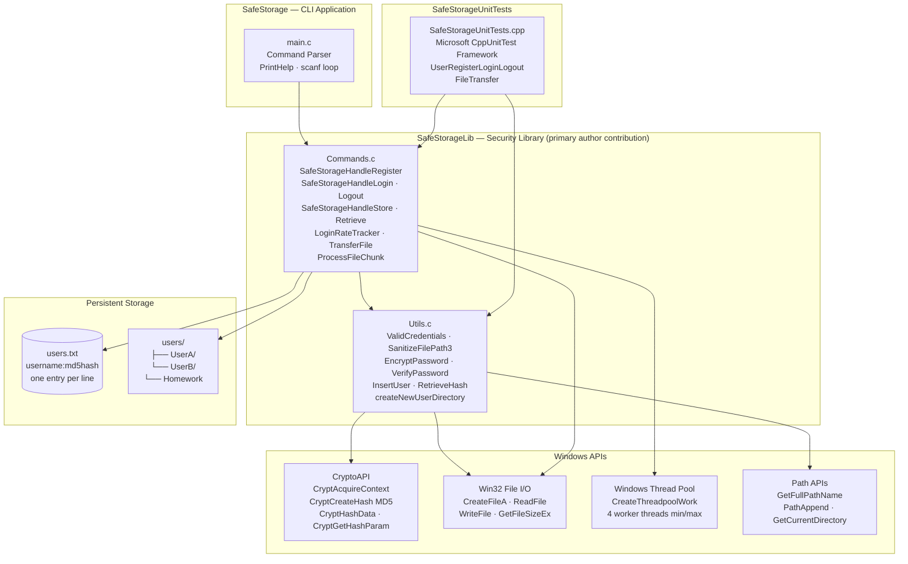
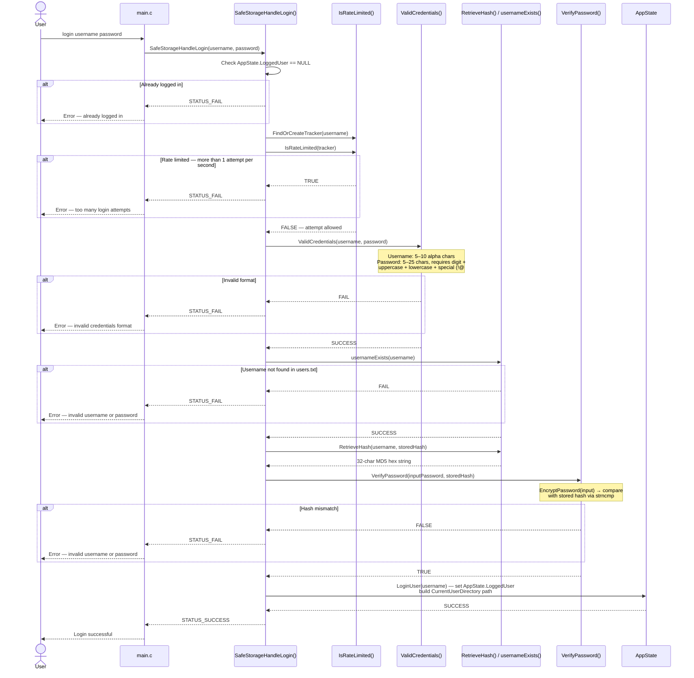
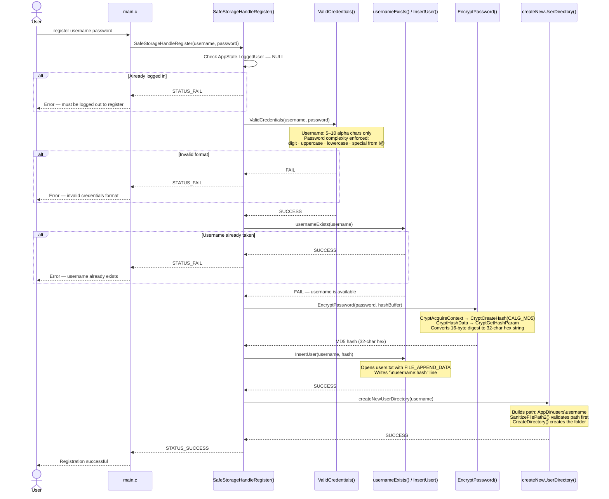
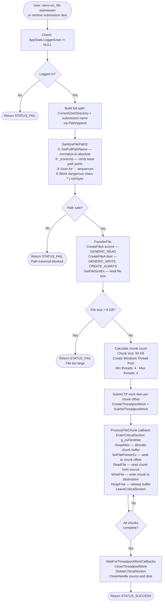
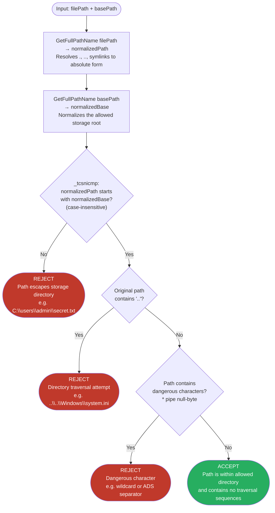
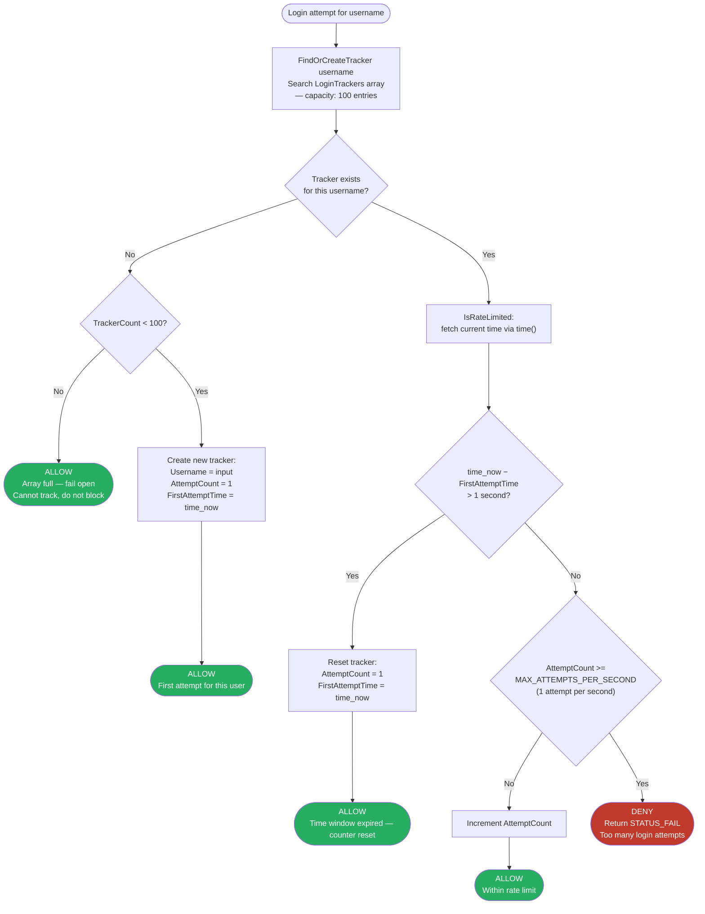

# SafeStorage — Mermaid Diagram Source Code

> **Usage:** Copy each code block into [Mermaid Live](https://mermaid.live), render, and save the PNG into `docs/` using the filename indicated under each title.
>
> All diagrams reflect actual function calls and data flows from the source code.

---

## 1. System Architecture

**Save as:** `docs/architecture.png`

---

## 2. User Authentication Flow

**Save as:** `docs/authentication_flow.png`

---

## 3. User Registration Flow

**Save as:** `docs/registration_flow.png`

---

## 4. File Transfer — Store and Retrieve

**Save as:** `docs/file_transfer.png`

---

## 5. Path Traversal Prevention — SanitizeFilePath3

**Save as:** `docs/path_traversal_prevention.png`

---

## 6. Rate Limiting — Login Brute Force Protection

**Save as:** `docs/rate_limiting.png`

